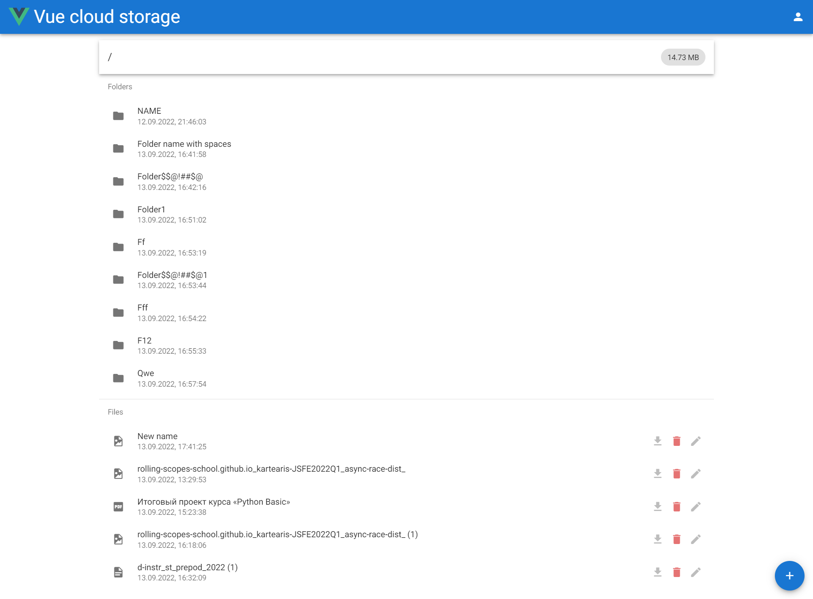
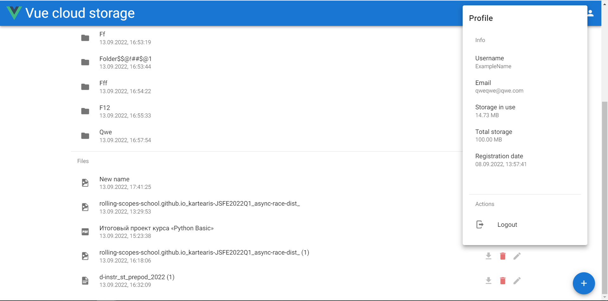
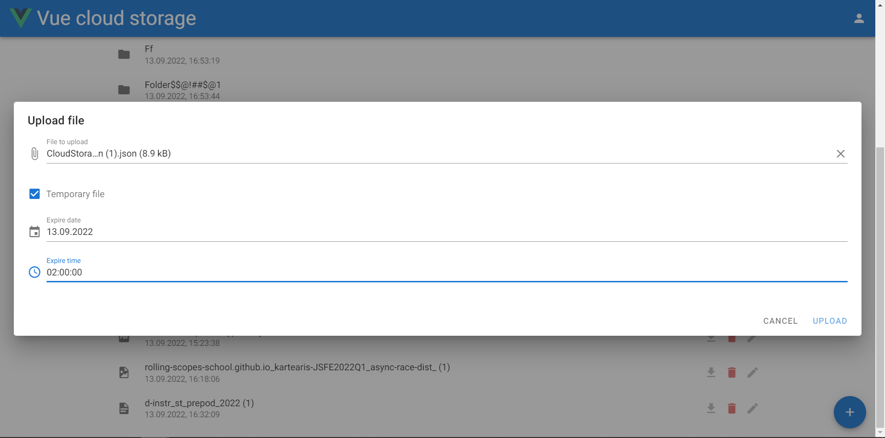
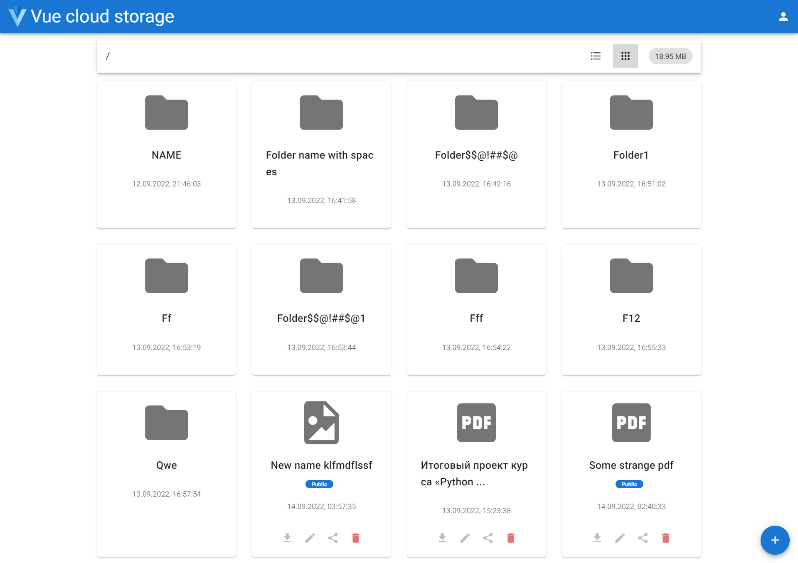

# Vue cloud storage

## Описание

Vue cloud storage - прототип сервиса облачного 
хранилища файлов, использующий в качестве бэкенда http://markwebdev.ru/api/v1.

Деплой: http://github.kartearis.xyz/dist/

Для деплоя используется кастомный домен, чтобы можно было использовать http
(иначе нельзя обратиться к http API).

Работа заняла 28 часов (+5 часов для реализации перключения вида, удаления файлов по таймеру и публичных ссылок).

### Реализованные функции

- регистрация и авторизация пользователей
- просмотр списка файлов
- загрузка и скачивание файлов
- валидация загружаемых файлов на клиенте 
(ограничение размера файла 20МБ, а также запрет на расширение .php)
- переименование файлов
- удаление файлов
- создание папок
- навигация по папкам
- отображение общего занятого и доступного объёма 
(в профиле пользователя)
- отображение суммарного объёма файлов в папке
(в заголовке папки при её просмотре)

Вёрстка приложение адаптивна.

Иконки файлов устанавливаются в зависимости от расширения 
(список поддерживаемых расширений легко пополнить).

Пользователь может выбрать просмотр файлов в виде списка (таблицы) или сетки. Выбор сохраняется локально
(сбрасывается при выходе из аккаунта).

При загрузке нового файла можно указать дату и время, 
до которых он будет существовать. Такие файлы выделяются тегом и удаляются из интерфейса
автоматически, когда подходит заданное время.

Файл можно сделать доступным публично, для этого нужно нажать кнопку "поделиться" в строке
или на карточке файла, после чего будет показана сгенерированная публичная ссылка. Используются
ссылки, отличные от предоставляемых API - они ведут на специальный роут приложения, который
уже перенаправит запрос в API, не раскрывая его пользователю. Публичные файлы также отмечаются
тегом при просмотре.

Приложение разработано на базе фреймворка Vue и библиотеки компонентов Vuetify.






## Project setup

Для установки библиотек используйте
```
npm install
```

Для сборки
```
npm run build
```
